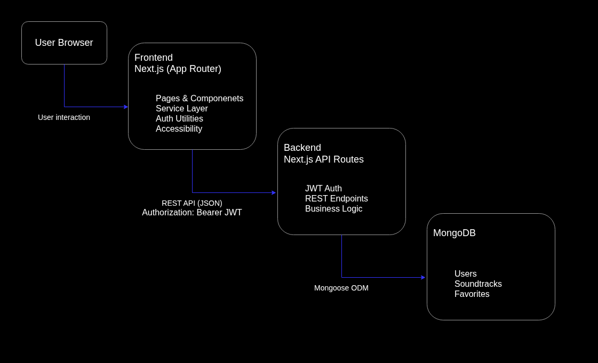

# 🎬🎵 Soundtrack Mood Explorer
A backend service for the Soundtrack Mood Explorer application, responsible for authentication, data persistence, and REST API endpoints.

Built as a portfolio project to demonstrate backend development with JWT authentication, MongoDB, and clean RESTful API design.

## 🚀 Features
- 🔐 JWT-based user authentication
- 👤 Protected API routes
- ⭐ Favorites management per user
- 🎵 Soundtrack data storage and retrieval
- 🌐 REST API with proper HTTP semantics
- 💾 Persistent data storage with MongoDB

## 🛠 Tech Stack
### Backend
- Next.js API Routes (App Router)
- Node.js
- MongoDB
- Mongoose ODM
- JSON Web Tokens (JWT)

 ## 📂 Project Structure
This project is split into two independent repositories:
```bash
backend/
 ├── src/app/api
 ├── src/models
 ├── src/lib
 └── ...
```
The frontend and backend communicate only via HTTP requests, making them fully decoupled.

## 🏗 Architecture Overview



The backend exposes REST API endpoints using Next.js API routes.
Authentication is handled via JWT, and data is persisted in MongoDB using Mongoose.
The frontend communicates exclusively via HTTP requests.

## 🏗 Project Architecture
- Frontend: Next.js (Port 3001)
- Backend API: Next.js API Routes (Port 3000)
- Database: MongoDB (Local)
The frontend communicates with the backend using the NEXT_PUBLIC_API_URL environment variable.

## 🔐 Authentication
- Authentication is handled using JSON Web Tokens (JWT)
- Tokens are sent via the `Authorization: Bearer <token>` header
- Protected routes:
  - Favorites
  - Profile
- Unauthorized request return HTTP `401`

## 🔌 API Endpoint Examples

### 🔐 POST `/api/auth/login`

Authenticate a user and return a JWT token.

**Request**
```http
POST /api/auth/login
Content-Type: application/json
```
```json
{
  "email": "user@example.com",
  "password": "password123"
}
```
**Successfgul Response**
```json
{
  "token": "eyJhbGciOiJIUzI1NiIsInR5cCI6IkpXVCJ9..."
}
```
**Error Response**
```json
{
  "message": "Invalid email or password"
}
```
### ⭐ POST `/api/favorites`

Add a soundtrack to the authenticated user's favorites.

**Request**
```http
POST /api/favorites
Authorization: Bearer <JWT_TOKEN>
Content-Type: application/json
```
```json
{
  "soundtrackId": "6978077a7e6d488aba392d46"
}
```
**Response**
```json
{
    "message": "Soundtrack added to favorites"
}
```
**Unauthorized**
```json
    {
      "message": "Unauthorized"
    }
```
### ❌ DELETE `/api/favorites/:soundtrackId`

Remove a soundtrack from favorites (idempotent operation).

```http
DELETE /api/favorites/6978077a7e6d488aba392d46
Authorization: Bearer <JWT_TOKEN>
```

**Response**
```json
{
  "message": "Soundtrack removed from favorites"
}
```

## ⭐ Favorites System
 - Favorites are stored per user in MongoDB
 - Each favorite is uniquely identified by:
   - `userId + soundtrackId`
 - Duplicate entries are prevented at the database level
 - DELETE endpoint is idempotent (safe repeated calls)

## 🧠 Key Technical Highlights
- Defensive API logic for authenticated / unauthenticated users
- Idempotent REST endpoint design
- Proper MongoDB `ObjectId` handling
- Next.js App Router-compatible async route params
- Clear separation of concerns (routes, models, utils)

## ⚙️ Environment Variables
Create a .env.local file in the root of the backend project with the following variables:
```
MONGODB_URI=mongodb://localhost:27017/soundtrack-explorer
PORT=3000
JWT_SECRET=super_secret_key_123
```
- `MONGODB_URI` - MongoDB connection string
- `PORT` - Port where the backend API runs
- `JWT_SECRET` - Secret key used for authentication

## ▶️ Running the Backend
1. Install dependencies:
```
npm install
```
2. Start the development server:
```
npm run dev
```
The Backend API will run at:
```
http://localhost:3000
```
API routes are available under:
```
http://localhost:3000/api
```
Example:
```
http://localhost:3000/api/soundtracks
```

  ## 🧪 Tested Use Cases
 - Register & login
 - Browse soundtracks
 - View soundtrack details
 - Add/remove favorites
 - Persistent favorites after refresh
 - Proper behavior when logged out

## 📌 Future Improvements
 - Pagination
 - Advanced filtering
 - User profile editing
 - Deployment (Vercel + MongoDB Atlas)
 - Unit and integration tests

## 👨‍💻 Author

**Frantisek Babinsky**  
Junior Full-Stack Developer  

Built as part of a professional portfolio project.